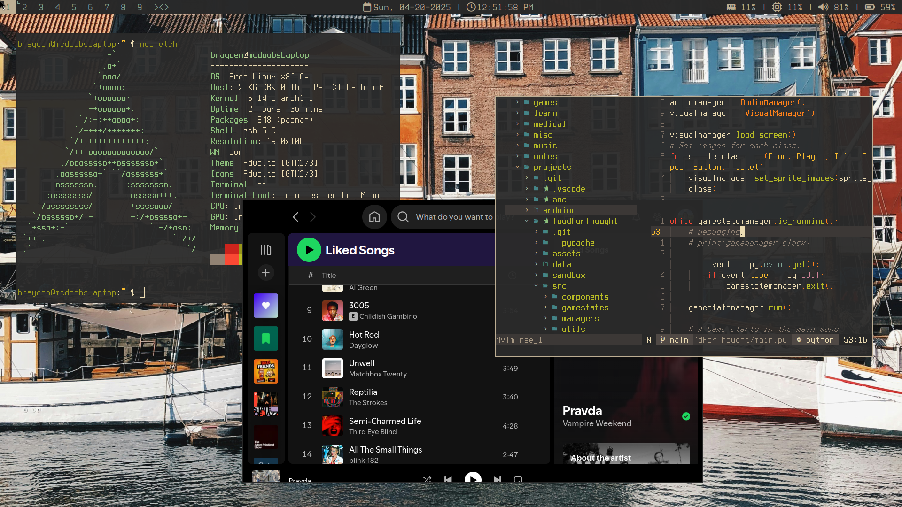

# dotfiles
My multi-system work and home Linux configuration files managed with  [chezmoi](https://github.com/twpayne/chezmoi) :)

## Screenshots

## Common programs
- os: [arch linux](https://archlinux.org)
- shell: [zsh](https://www.zsh.org)
- dotfile manager: [chezmoi](https://www.chezmoi.io)
- file sync: [syncthing](https://syncthing.net)
- window system: [xorg](https://www.x.org)
- tiling window manager: [dwm](https://dwm.suckless.org)
- terminal: [st](https://st.suckless.org)
- terminal multiplexer: [tmux](https://github.com/tmux/tmux)
- status bar: [slstatus](https://tools.suckless.org/slstatus)
- text editor/IDE: [Neovim (kickstart)](https://github.com/nvim-lua/kickstart.nvim)
- vector art: [inkscape](https://inkscape.org)
- photoviewing: [feh](https://feh.finalrewind.org)

## Favorite python stuff
- [Pygame-ce](https://pyga.me/)
- [PyTorch](https://pytorch.org/)
- [Ruff](https://docs.astral.sh/ruff/)
- [cookiecutter-data-science](https://cookiecutter-data-science.drivendata.org/)
